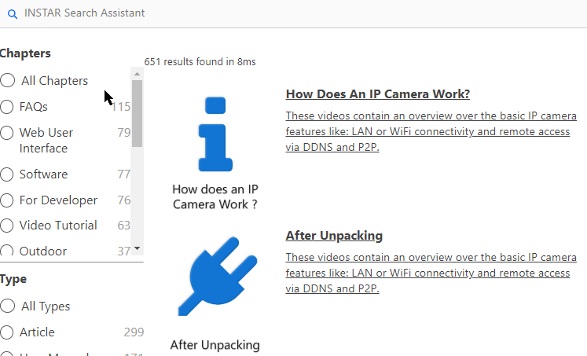

```md
This project was bootstrapped with [Create React App](https://github.com/facebook/create-react-app).

## Available Scripts

In the project directory, you can run:

### `npm start`

Runs the app in the development mode.
Open [http://localhost:3000](http://localhost:3000) to view it in the browser.

The page will reload if you make edits. You will also see any lint errors in the console.
```





# ReactiveSearch App

We can either add [ReactiveSearch](https://opensource.appbase.io/reactivesearch) to an existing app or create a boilerplate app with Create React App (CRA):


```bash
create-react-app search-app && cd search-app
```


## Install ReactiveSearch

We will fetch and install reactivesearch module using yarn or npm.


```bash
npm install @appbaseio/reactivesearch
```


## Building your App

Lets add our first ReactiveSearch component: [ReactiveBase](https://opensource.appbase.io/reactive-manual/getting-started/reactivebase.html), it is a backend connector where we can configure the Elasticsearch index / authorization setup.


We will update our `src/App.js` file to add ReactiveBase component and connect them to our local instance of Elasticsearch 7.8:


```js
import React, { Component } from "react";

import {
  ReactiveBase,
  CategorySearch,
  SelectedFilters,
  ReactiveList,
  SingleList,
  MultiList,
  ResultList,
} from "@appbaseio/reactivesearch";

const { ResultListWrapper } = ReactiveList;

const flexBox = {
  display: "flex",
  marginTop: 20,
};

const flexColumn = {
  flexDirection: "row",
};

const tagsSelector = {
  minHeight: "100%",
};

class App extends Component {
  render() {
    return (
      <ReactiveBase url="http://localhost:9200" app="wiki_ssr_en_2020_07_06">
        <CategorySearch
          componentId="q"
          //title="WikiSearch"
          placeholder="INSTAR Search Assistant"
          categoryField="chapter.raw"
          defaultValue={{
            term: "first steps",
            category: "*",
          }}
          react={{
            and: ["chapter_filter", "tag_filter", "type_filter"],
          }}
          dataField={["title", "tags", "abstract", "description"]}
          fieldWeights={[8, 10, 5, 3]}
          //queryFormat="or"
          searchOperators="true"
          autosuggest={true}
          highlight={true}
          //highlightField="abstract"
          defaultSuggestions={[
            { label: "First Steps", value: "first steps" },
            { label: "Installation", value: "installation" },
            { label: "Web User Interface", value: "web user interface" },
            { label: "InstarVision", value: "instarvision" },
          ]}
          fuzziness={1}
          debounce={100}
          showFilter={true}
          filterLabel="Filter"
          URLParams={true}
        />
        <SelectedFilters />
        <div style={flexBox}>
          <div style={flexColumn}>
            <SingleList
              componentId="chapter_filter"
              dataField="chapter.raw"
              title="Chapters"
              size={100}
              sortBy="count"
              defaultValue="All Chapters"
              selectAllLabel="All Chapters"
              showRadio={true}
              showCount={true}
              showSearch={false}
              //placeholder="Search Chapters"
              react={{
                and: ["q"],
              }}
              showFilter={true}
              filterLabel="Filter"
              URLParams={false}
              loader="Loading ..."
            />

            <hr />

            <SingleList
              componentId="type_filter"
              dataField="type.raw"
              title="Type"
              size={100}
              sortBy="count"
              defaultValue="All Types"
              selectAllLabel="All Types"
              showRadio={true}
              showCount={true}
              showSearch={false}
              react={{
                and: ["q"],
              }}
              showFilter={true}
              filterLabel="Filter"
              URLParams={false}
              loader="Loading ..."
            />

            <hr />

            <MultiList
              componentId="tag_filter"
              dataField="tags.raw"
              title="Tags"
              react={{
                and: ["q"],
              }}
              showSearch={false}
              style={tagsSelector}
              URLParams={false}
              loader="Loading ..."
            />

            <hr />
          </div>{" "}
          {/* FlexColumn */}
          <ReactiveList
            from={0}
            size={15}
            pagination
            react={{
              and: ["q", "chapter_filter", "tag_filter", "type_filter"],
            }}
            componentId="SearchResult"
          >
            {({ data, error, loading }) => (
              <ResultListWrapper>
                {data.map((item) => (
                  <a href={"https://wiki.instar.com" + item.sublink1}>
                    <ResultList key={item._id}>
                      <ResultList.Image
                        src={"https://wiki.instar.com/" + item.imagesquare}
                      />
                      <ResultList.Content>
                        <ResultList.Title
                          dangerouslySetInnerHTML={{
                            __html: item.title,
                          }}
                        />
                        <ResultList.Description
                          dangerouslySetInnerHTML={{
                            __html: item.abstract,
                          }}
                        />
                      </ResultList.Content>
                    </ResultList>
                  </a>
                ))}
              </ResultListWrapper>
            )}
          </ReactiveList>
        </div>{" "}
        {/* FlexBox */}
      </ReactiveBase>
    );
  }
}

export default App;
```